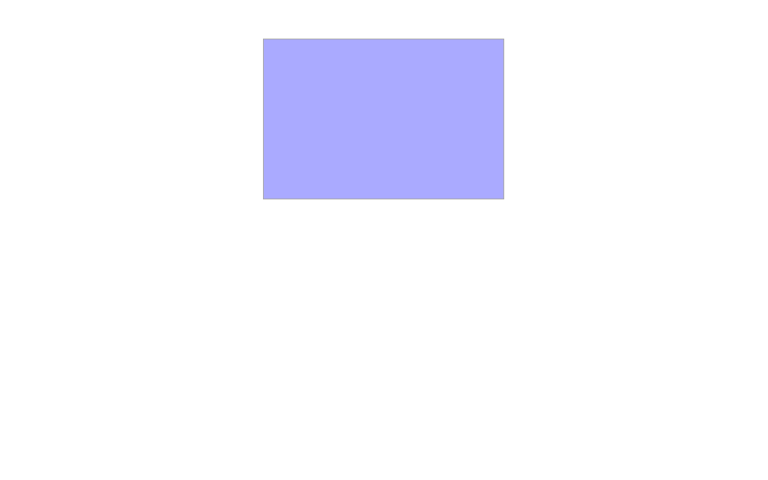

# CSS로 슬라이드를 다루는 방법

---

## 개요

3초마다 이미지가 전환되는 슬라이드를 만들려면 어떻게 해야할까?
먼저 간단하게 HTML을 구성하여 보자.

```html
<div class="slide-wrap">
  <div class="slide"></div>
  <div class="slide"></div>
  <div class="slide"></div>
</div>
```

간단하게 슬라이드를 감싸는 slide-wrap 을 만들고, 안에 slide 를 3장 넣게끔 하였다.
이제 이 HTML에 간단한 CSS를 입혀보자.

```css
* {
  margin: 0;
  padding: 0;
  box-sizing: border-box;
}

.slide-wrap {
  position: relative;
  margin: 50px auto;
  width: 300px;
  height: 200px;
  border: 1px solid #aaa;
  overflow: hidden;
}

.slide {
  position: absolute;
  left: 0;
  top: 0;
  width: 100%;
  height: 100%;
}
.slide-1 { background-color: #faa; }
.slide-2 { background-color: #afa; }
.slide-3 { background-color: #aaf; }
```

지금까지 만들어진 내용을 보면 다음과 같다.



이제 애니메이션을 만들어 보도록 한다.
이미지는 총 3장이라고 가정하였을 때, 3초 동안 이미지가 보여지고, 0.5초의 시간 동안 이미지가 전환된다고 생각해 보자.

| (이미지 대기시간 3초 + 이동시간 0.5초) * 3 = 10.5초

따라서 @keyframes 을 0 ~ 100%로 구분할 때, 0% 는 0s, 100% 는 10.5s 가 된다.
이를 비율로 계산해서, 3초를 퍼센트로 환산하면 다음과 같이 계산한다.

| 3초 : 10.5초 = n% : 100%
| 3 * 100 / 10.5 = 28.571%

따라서 현재 만들고자 하는 @keyframes 에서 3초는 28.571% 에 해당한다.
이와 동일한 방법으로 @keyframes 를 만들면 다음과 같다.

```css
@keyframes slide {
  /* 0s 3 */
  0% { left: -100%; }
  /* 0.5s 1 */
  4.7619% { left: 0; }
  /* 3.5s 1 */
  33.333% { left: 0; }
  /* 4s 2 */
  38.095% { left: 100%; }
  /* 7s 2 */
  66.666% { left: 100%; }
  /* 7.5s 3 */
  71.428% { left: 100%; }
  /* 10.5s 3 */
  100% { left: 100%; }
}
```

이제 만든 @keyframes 를 직접 적용해 보도록 하자

```css
.slide {
  animation-name: slide;
  animation-duration: 10.5s;
  animation-iteration-count: infinite;
}
.slide-1 { animation-delay: -0.5s; }
.slide-2 { animation-delay: -7.5s; }
.slide-3 { animation-delay: -4s; }
```

animation-delay 는 값을 음수로 설정하면, 해당 시간만큼 애니메이션의 시작 시간을 앞으로 당길 수 있다.
slide-1 은 첫번째, slide-2 는 두번째, slide-3 을 세번째로 슬라이드에 나오도록 설정한다.
위 코드까지 적용하면 기본적인 슬라이드 구성이 완료된다.

## 슬라이드 컨트롤

이제 슬라이드를 이동시키는 버튼을 추가해 보도록 하자.
HTML/CSS만으로 슬라이드를 이동시키려면, 현재 슬라이드가 몇번째인지 저장할 수단이 필요하다.
input[type="radio"]를 통해 현재 슬라이드를 저장할 수 있다. HTML의 상단에 다음과 같은 내용을 추가한다.

```html
<input type="radio" name="s" id="s1" hidden>
<input type="radio" name="s" id="s2" hidden>
<input type="radio" name="s" id="s3" hidden>

<div class="slide-wrap">
  ...
```

그리고 slide-wrap 아래에는 해당 label 들을 컨트롤 할 수 있는 control 들을 생성해 준다.

```html
<div class="control-wrap">
  <div class="control">
  </div>
  <div class="control">
  </div>
  <div class="control">
  </div>
</div>
```

```css
.control-wrap {
  justify-content: center;
  display: flex;
  gap: 5px;
}
.control {
  position: relative;
  width: 10px;
  height: 10px;
  border-radius: 50%;
  border: 1px solid #555;
  cursor: pointer;
}
.control .label {
  position: absolute;
  left: 0;
  top: 0;
  width: 100%;
  height: 100%;
  z-index: -1;
}
```

## 생각해 보아야 할 문제점

### 1. 역방향이동 문제

이제 각 컨트롤을 클릭하였을 때, 해당 위치로 슬라이드가 이동할 수 있게끔 수정해주어야 하는데, 한번 생각해봐야 하는 문제에 직면하게 된다. 슬라이드는 기본적으로 정방향(1->2->3) 순서대로 움직이는데, 만약 현재 슬라이드가 3이고 슬라이드 2로 이동하려면 역방향(3->2)로 슬라이드가 움직여야만 한다.

만약 해당 과정이 @keyframes 안에 포함되게 되면 (1->2->3->2->3->1->2->..) 와 같이, 순서가 꼬여버리게 될 것이다. 이 때문에 우리는 @keyframes 를 여러개 만들어서 이전으로 움직이는 애니메이션을 하나 만들어야 한다.

### 2. animation-delay 문제

위 역방향이동 문제를 해결하고자 animation 을 여러개 등록하였을 때, 추가적으로 문제가 발생하게 된다. 예를 들어 다음과 같이 코드를 작성하였다고 가정하여 보자.

```css
@keyframes example1 {
  from { left: 0; }
  to { left: 1000px; }
}
@keyframes example2 {
  from { left: 1000px; }
  to { left: 0; }
}

.example {
  animation-name: example1, example2;
  animation-duration: 10s, 10s;
  animation-delay: 0, -5s;
  animation-iteration-count: 1, infinite;
}
```

example1 은 개체가 오른쪽으로 이동, example2는 왼쪽으로 이동하는 @keyframes 이다. 얼핏 보면, 오른쪽으로 1000px 을 이동한 후 (example1), 다시 왼쪽으로 돌아오는 애니메이션 (example2) 가 반복될 것으로 보이지만, 실상은 순차실행이 아니라 동시실행이기 때문에 animation-delay 를 통한 애니메이션 미리 시작이 불가능하다. 따라서, 역방향 슬라이드의 경우 animation-delay 를 통한 슬라이드 구분이 불가능해져서 슬라이드를 1, 2, 3번째마다 각각 따로 생성해 줄 필요가 있다.

## 3. 애니메이션 중복 문제

만약에 첫번째 control 을 클릭해서 첫번째 슬라이드로 이동하였다고 가정해 보자. 그 상태로 슬라이드가 2, 3번째가 될 때까지 기다렸다가 다시 첫번째 control 을 눌렀을 때, 동일한 radio 를 바라보고 있다면, radio 특성상 이미 선택 중인 input 을 재선택하기는 불가능하기 때문에, 이동되지 않는 버그가 발생한다. 따라서 radio 의 복사본을 만들어서, 동일한 기능을 할 수 있도록 만들어 주어야 한다.

## 컨트롤 기능 추가하기

위에서 살펴본 문제점을 해결하기 위한 해결 방안은 다음과 같다.

- 정방향 슬라이드와 역방향 슬라이드를 구분지어 애니메이션을 설정해야한다.
- 역방향 슬라이드의 경우 애니메이션을 두 가지 사용하여 역방향으로 이동할 수 있게 설정해야한다.
- 애니메이션이 중복되지 않도록, slide / radio 의 복사본을 만들어 동일한 역할을 수행하도록 해야 한다.
